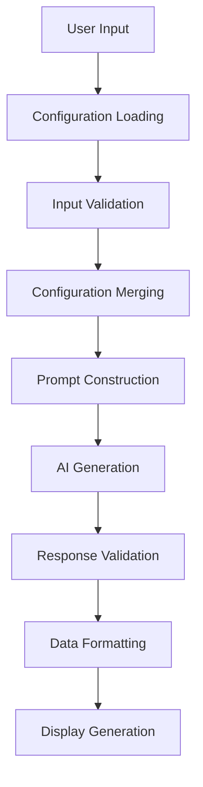

# AI Fasting Planner - Program Flow Documentation

This document provides a comprehensive overview of how the AI Fasting Planner application works, from startup to meal plan generation and display.

## Table of Contents
1. [Application Architecture](#application-architecture)
2. [Entry Point & CLI Setup](#entry-point--cli-setup)
3. [Command Structure](#command-structure)
4. [Configuration Management](#configuration-management)
5. [Meal Plan Generation Flow](#meal-plan-generation-flow)
6. [Waiting Experience System](#waiting-experience-system)
7. [Data Flow & Processing](#data-flow--processing)
8. [Output Generation](#output-generation)
9. [Error Handling](#error-handling)
10. [File Structure & Dependencies](#file-structure--dependencies)

## Application Architecture

The AI Fasting Planner is a **command-line interface (CLI) application** built with TypeScript that generates personalized keto meal plans using AI. The application follows a modular architecture with clear separation of concerns:

```
┌─────────────────┐    ┌──────────────────┐    ┌─────────────────┐
│   CLI Interface │    │  Configuration   │    │  AI Integration │
│   (Commander)   │◄──►│   Management     │◄──►│   (OpenRouter)  │
└─────────────────┘    └──────────────────┘    └─────────────────┘
         │                       │                       │
         ▼                       ▼                       ▼
┌─────────────────┐    ┌──────────────────┐    ┌─────────────────┐
│  User Prompts   │    │  Global Settings │    │  Waiting System │
│   (Inquirer)    │    │   (JSON Config)  │    │  (Animations)   │
└─────────────────┘    └──────────────────┘    └─────────────────┘
```

## Entry Point & CLI Setup

### 1. Application Initialization

The application starts in `src/index.ts` with the following initialization sequence:

```typescript
#!/usr/bin/env node
import dotenv from 'dotenv';
import path from 'path';
import fs from 'fs';
import os from 'os';

// Load environment variables from .env.local first, then .env
dotenv.config({ path: path.join(process.cwd(), '.env.local') });
dotenv.config(); // This loads .env as fallback
```

**Key Points:**
- Uses shebang (`#!/usr/bin/env node`) for direct execution
- Loads environment variables with priority: `.env.local` → `.env`
- Imports all necessary dependencies (Commander, AI SDK, Inquirer, etc.)

### 2. CLI Program Setup

The application uses Commander.js for CLI interface:

```typescript
const program = new Command();

program
    .name('fast-plan')
    .description('AI-powered keto meal planner with 36-hour fasting support')
    .version(packageJson.version);
```

**Default Command Behavior:**
- If no command is specified, automatically runs `generate` command
- This is handled by: `if (process.argv.length === 2) { process.argv.push('generate'); }`

## Command Structure

The application supports three main commands:

### 1. `fast-plan setup`
**Purpose:** Initial configuration and API key setup

**Flow:**
1. **API Key Collection**
   - Prompts for OpenRouter API key
   - Validates key format
   - Offers to save for future use

2. **Model Selection**
   - Presents list of available AI models
   - Sets default model preference
   - Validates model selection

3. **App Attribution Setup**
   - Configures OpenRouter analytics
   - Sets app URL and title for tracking
   - Optional but recommended for usage analytics

4. **Default Preferences**
   - Collects user preferences (weight, height, age, etc.)
   - Saves to global configuration
   - Allows skipping future prompts

**Configuration Storage:**
- Saves to `~/.ai-fasting-planner/config.json`
- Merges with existing configuration
- Creates directory structure if needed

### 2. `fast-plan generate`
**Purpose:** Generate personalized meal plan

**Flow:**
1. **Configuration Loading**
   - Loads global configuration
   - Loads test configuration if provided via `--config`
   - Merges configurations with priority: CLI > Test Config > Global > Defaults

2. **User Input Collection**
   - Prompts for missing information
   - Skips prompts if data available from config
   - Validates input (age, weight, etc.)

3. **API Key Resolution**
   - Checks multiple sources: Global Config > User Input > Environment Variable
   - Exits if no valid API key found

4. **Model Selection**
   - Uses CLI override if provided
   - Falls back to global default
   - Validates model against supported list

5. **Prompt Generation**
   - Uses custom template if provided in config
   - Falls back to default prompt
   - Substitutes variables with user data

6. **AI Generation**
   - Creates OpenRouter provider with attribution headers
   - Calls AI model with structured output schema
   - Handles waiting experience during generation

7. **Result Processing**
   - Validates AI response against Zod schema
   - Formats data for display
   - Shows interactive meal plan

### 3. `fast-plan config`
**Purpose:** View and manage configuration

**Options:**
- `--show`: Display current configuration
- `--clear`: Remove all saved configuration
- `--path`: Show configuration file location
- No options: Interactive menu

## Configuration Management

### Configuration Hierarchy

The application uses a sophisticated configuration system with multiple layers:

```
1. CLI Arguments (highest priority)
2. Test Configuration File (--config flag)
3. Global Configuration (~/.ai-fasting-planner/config.json)
4. Environment Variables
5. Default Values (lowest priority)
```

### Configuration Sources

**Global Configuration (`~/.ai-fasting-planner/config.json`):**
```typescript
interface GlobalConfig {
    apiKey?: string;
    appUrl?: string;
    appTitle?: string;
    defaultModel?: string;
    defaults?: {
        fastingStart?: string;
        fastingEnd?: string;
        diet?: string;
        currentWeight?: string;
        targetWeight?: string;
        timeframe?: string;
        sex?: string;
        age?: string;
        height?: string;
        activityLevel?: string;
    };
}
```

**Test Configuration (JSON file):**
- Supports all user input fields
- Includes `promptTemplate` for custom AI prompts
- Used for development and testing

**Environment Variables:**
- `OPENROUTER_API_KEY`: API key for OpenRouter
- `APP_URL`: Application URL for analytics
- `APP_TITLE`: Application title for analytics
- `DEBUG_PROMPT`: Enable debug logging

## Meal Plan Generation Flow

### 1. Input Collection Phase

```typescript
const answers: Config = await inquirer.prompt([
    {
        type: 'input',
        name: 'fastingStart',
        message: 'Fasting start?',
        default: testConfig.fastingStart || defaults.fastingStart || 'Friday 8pm',
        when: () => !testConfig.fastingStart && !defaults.fastingStart
    },
    // ... more prompts
]);
```

**Smart Prompting:**
- Uses `when` condition to skip prompts if data already available
- Merges multiple configuration sources
- Validates input (age range, required fields)

### 2. Prompt Construction

**Default Prompt Template:**
```typescript
const defaultPrompt = `Create a comprehensive 6-day keto meal plan with detailed cooking instructions and nutritional information. Skip Saturday for 36-hour fast (${finalAnswers.fastingStart} to ${finalAnswers.fastingEnd}). Each meal should be home-cooked, under 30 minutes prep time, and strictly avoid processed foods, sugary drinks, and high-carb items. Include specific ingredients, cooking steps, and estimated macros (fat/protein/carbs). Tailor the portions and ingredients for: ${finalAnswers.sex}, age ${finalAnswers.age}, height ${finalAnswers.height}, current weight ${finalAnswers.currentWeight}, target weight ${finalAnswers.targetWeight} in ${finalAnswers.timeframe}, activity level: ${finalAnswers.activityLevel}. Format as: 1. Sunday: [Meal Name] - Ingredients: [...] - Instructions: [...] - Macros: [...], 2. Monday: [continue pattern]`;
```

**Custom Prompt Support:**
- Supports variable substitution: `${finalAnswers.sex}`, `${finalAnswers.age}`, etc.
- Allows complete prompt customization via config files
- Enables A/B testing of different prompt strategies

### 3. AI Model Integration

**OpenRouter Provider Setup:**
```typescript
const openrouterProvider = createOpenRouter({
    apiKey: apiKey,
    headers: {
        'HTTP-Referer': globalConfig.appUrl || process.env.APP_URL || 'https://github.com/your-username/ai-fasting-planner',
        'X-Title': globalConfig.appTitle || process.env.APP_TITLE || 'AI Fasting Planner',
    },
});
```

**Structured Output Schema:**
```typescript
const mealPlanSchema = z.object({
    days: z.array(z.object({
        day: z.string(),
        meals: z.array(z.object({
            name: z.string(),
            type: z.enum(['breakfast', 'lunch', 'dinner', 'snack']).optional(),
            prepTime: z.string().optional(),
            ingredients: z.array(z.string()).optional(),
            instructions: z.array(z.string()).optional(),
            macros: z.object({
                calories: z.number().optional(),
                fat: z.number().optional(),
                protein: z.number().optional(),
                carbs: z.number().optional()
            }).optional()
        }))
    })),
    fastingPeriod: z.object({
        start: z.string(),
        end: z.string(),
        skippedDay: z.string()
    }).optional()
});
```

### 4. AI Generation Process

```typescript
const { object: mealPlan } = await generateObject({
    model: openrouterProvider(selectedModel),
    prompt,
    schema: mealPlanSchema,
});
```

**Key Features:**
- Uses Vercel AI SDK for structured output
- Ensures response matches Zod schema
- Handles API errors gracefully
- Supports multiple AI models via OpenRouter

## Waiting Experience System

The application includes an innovative waiting experience system that keeps users engaged during AI generation.

### Architecture

```typescript
export class WaitingExperience {
    private animation: LoadingAnimations;
    private quiz: KetoQuiz;
    private scramble: WordScramble;
    private facts: NutritionFacts;
}
```

### Available Experiences

1. **🍳 Cooking Animation**
   - ASCII art cooking steps
   - Rotating chef emojis
   - Progress messages

2. **⏰ Fasting Clock**
   - Animated clock faces
   - Fasting-related progress messages
   - Time-based animations

3. **🔄 Food Transformation**
   - Ingredients transforming into meals
   - Visual progression of meal creation

4. **🧠 Keto Quiz**
   - 4 interactive questions about keto and fasting
   - Educational content with explanations
   - Score tracking

5. **🔤 Word Scramble**
   - Nutrition and fasting term scrambles
   - Hint system
   - Educational value

6. **📚 Nutrition Facts**
   - Rotating educational facts
   - Keto and fasting knowledge
   - Timed display

7. **🎲 Random**
   - Randomly selects from available experiences
   - Weighted towards educational content

### Implementation Details

**Non-blocking Design:**
- Interactive experiences (quiz, scramble) run before AI generation
- Animations run during AI generation
- Facts display with timed intervals

**Smart Timing:**
```typescript
static async handleWaitingPeriod<T>(
    asyncOperation: () => Promise<T>,
    experienceType: WaitingExperienceType = 'random'
): Promise<T> {
    // Different handling for interactive vs non-interactive experiences
    if (experienceType === 'quiz' || experienceType === 'scramble') {
        await experience.start(experienceType);
        experience.animation.startSpinner(['Finalizing your personalized meal plan...']);
        const result = await asyncOperation();
        experience.stop();
        return result;
    }
    // ... other experience types
}
```

## Data Flow & Processing

### 1. Input Processing



### 2. Configuration Merging Logic

```typescript
const finalAnswers: Config = {
    fastingStart: testConfig.fastingStart || answers.fastingStart || defaults.fastingStart || 'Friday 8pm',
    fastingEnd: testConfig.fastingEnd || answers.fastingEnd || defaults.fastingEnd || 'Sunday 8am',
    diet: testConfig.diet || answers.diet || defaults.diet || 'Keto',
    // ... more fields
};
```

### 3. Data Validation

**Zod Schema Validation:**
- Ensures AI response matches expected structure
- Provides type safety throughout application
- Handles optional fields gracefully

**Input Validation:**
- Age range validation (1-120)
- Required field checking
- Format validation for weights, heights

## Output Generation

### 1. Table Display

```typescript
const table = new Table({
    head: [chalk.cyan('Day'), chalk.cyan('Meal')],
    colWidths: [12, 80],
    wordWrap: true
});
```

**Features:**
- Fixed column widths for consistent display
- Word wrapping for long meal descriptions
- Color-coded headers and content

### 2. Detailed Meal View

**Interactive Navigation:**
- Day-by-day meal selection
- Detailed ingredient lists
- Step-by-step cooking instructions
- Nutritional macro information

**Export Options:**
- **Text Format**: Human-readable meal plan
- **JSON Format**: Machine-readable data
- **Shopping List**: Consolidated ingredient list

### 3. Export Generation

**Text Export:**
```typescript
function generateTextExport(mealPlan: MealPlan): string {
    let output = `KETO MEAL PLAN\n`;
    if (mealPlan.fastingPeriod) {
        output += `Fasting Period: ${mealPlan.fastingPeriod.start} - ${mealPlan.fastingPeriod.end}\n`;
        output += `Skipped Day: ${mealPlan.fastingPeriod.skippedDay}\n`;
    }
    // ... detailed formatting
}
```

**Shopping List Generation:**
- Deduplicates ingredients across all meals
- Sorts alphabetically
- Removes quantities for grouping

## Error Handling

### 1. Configuration Errors

```typescript
function loadTestConfig(configPath: string): TestConfig {
    try {
        const configFile = fs.readFileSync(configPath, 'utf8');
        const config = JSON.parse(configFile);
        console.log(chalk.yellow(`📁 Loaded test configuration from: ${configPath}`));
        return config;
    } catch (error) {
        console.error(chalk.red(`❌ Error loading config file: ${configPath}`));
        console.error(chalk.red(`Error: ${error instanceof Error ? error.message : 'Unknown error'}`));
        process.exit(1);
    }
}
```

### 2. API Key Validation

```typescript
if (!apiKey) {
    console.error(chalk.red('❌ No API key found!'));
    console.log(chalk.yellow('Please run "fast-plan setup" to configure your API key.'));
    console.log(chalk.gray('Or set the OPENROUTER_API_KEY environment variable.'));
    process.exit(1);
}
```

### 3. Model Validation

```typescript
function validateModel(model: string): boolean {
    const isValidModel = OPENROUTER_MODELS.some(m => m.name === model);
    if (isValidModel) {
        return true;
    }
    const openRouterPattern = /^[a-zA-Z0-9_-]+\/[a-zA-Z0-9_.-]+$/;
    return openRouterPattern.test(model);
}
```

### 4. Graceful Degradation

- Continues operation with partial data
- Provides helpful error messages
- Suggests solutions for common issues
- Maintains user experience during errors

## File Structure & Dependencies

### Core Files

```
src/
├── index.ts              # Main CLI application (1,126 lines)
├── animations.ts         # Loading animations and mini-games (275 lines)
└── waitingExperience.ts  # Waiting experience orchestration (126 lines)
```

### Key Dependencies

**Runtime Dependencies:**
- `@openrouter/ai-sdk-provider`: AI model integration
- `ai`: Vercel AI SDK for structured output
- `commander`: CLI framework
- `inquirer`: Interactive prompts
- `chalk`: Terminal colors
- `cli-table3`: Table formatting
- `zod`: Data validation
- `dotenv`: Environment variable loading

**Development Dependencies:**
- `typescript`: TypeScript compiler
- `ts-node`: TypeScript execution
- `@types/*`: Type definitions

### Build Process

```json
{
  "scripts": {
    "start": "ts-node src/index.ts",
    "dev": "ts-node src/index.ts",
    "build": "tsc",
    "prepublishOnly": "npm run build"
  }
}
```

**Build Output:**
- TypeScript compiles to `dist/` directory
- CommonJS modules for npm compatibility
- Source maps for debugging

## Summary

The AI Fasting Planner is a well-architected CLI application that demonstrates several key software engineering principles:

1. **Modular Design**: Clear separation between CLI, configuration, AI integration, and user experience
2. **Configuration Management**: Sophisticated multi-layer configuration system
3. **User Experience**: Innovative waiting experience system that educates while entertaining
4. **Error Handling**: Comprehensive error handling with helpful user guidance
5. **Type Safety**: Full TypeScript implementation with Zod validation
6. **Extensibility**: Support for custom prompts, multiple AI models, and various export formats

The application successfully combines practical meal planning functionality with an engaging user experience, making it both useful and enjoyable to use.
